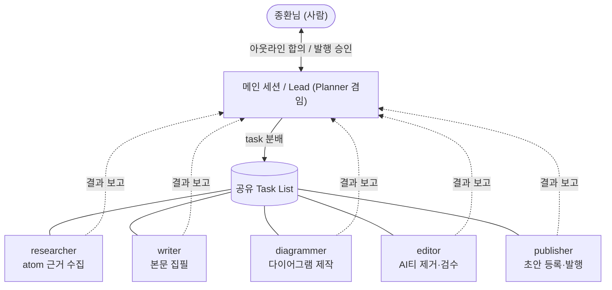
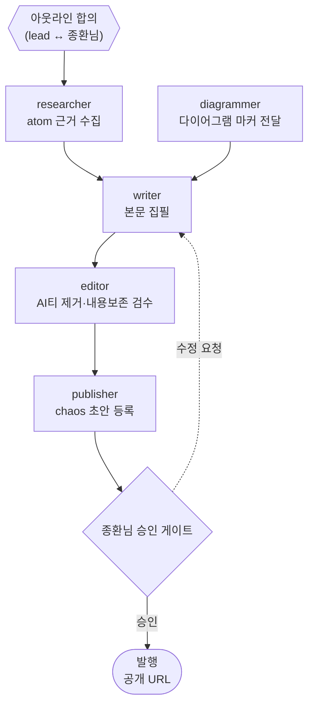

글을 쓰는 건 참 어려운 일이다. 주제를 잡고 흐름을 짜고 문장을 고르는 걸 글 한 편 내내 머리를 쥐어짜야 했다. 그게 버거워서 주마다 하나씩 발행하자고 목표를 세웠는데, 자꾸 미뤄졌고 결국 쓰지 않게 됐다.

글 초안을 AI에게 받아도 막상 마음에 들지 않아 많이 손봐야 했다. 한 세션한테 통째로 맡기니 기획부터 교정까지 혼자 역할을 갈아끼우며 쓰는 셈이라, 결과가 늘 어딘가 아쉬웠다. 그래서 이번엔 역할을 진짜로 쪼개봤다. 글 한 편을 다섯 명이 나눠 쓰는 팀을 만들어 한번 굴려본 기록이다.

## 누가 뭘 하나

팀원 타입은 하나뿐이다. `chaos-blog-team`. 스폰할 때 프롬프트에 `role:` 한 줄을 박으면 그 줄에 따라 다섯 역할 중 하나가 된다. 같은 베이스라인에서 출발해 맡는 일만 달라진다.

기획자는 따로 스폰하지 않는다. 메인 세션이 lead 겸 기획자 노릇을 하면서, 사람인 나와 아웃라인이나 발행 승인을 주고받는 창구를 맡는다. 나머지는 다섯이 나눈다.

researcher는 chaos에 쌓인 내 atom을 뒤져 글의 근거와 출처를 모은다. chaos는 PostgreSQL과 pgvector로 돌리는 내 세컨드 브레인인데, 검색하면 다 나오는 일반론은 거르고 내 기록에 실제로 있는 것만 골라 온다. writer는 아웃라인과 리서치를 합쳐 본문을 마크다운으로 쓴다. diagrammer는 다이어그램을 chaos에 등록하고, 본문에는 `[라벨](chaos-diagram:id)` 마커만 한 줄 돌려준다. editor는 다 쓴 본문에서 AI 티를 걷어낸다. publisher는 글을 초안으로 등록하고, 승인이 떨어지면 발행한다.

## 글이 나오는 순서

흐름은 이렇다. lead가 각도와 아웃라인을 잡아 나와 맞춰보고 나면, researcher의 리서치와 diagrammer의 다이어그램 제작이 동시에 출발한다. 둘 다 집필 재료라 서로를 기다릴 이유가 없다. 두 결과가 모이면 writer가 본문을 쓰고, editor가 다듬고, publisher가 초안으로 올린다.

순서를 한 세션이 기억으로 붙들고 있지 않다는 게 옛 방식과 다른 점이다. 의존 관계가 공유 태스크 리스트에 박혀 있어서, 한 태스크를 끝내면 완료 표시를 해야 다음 태스크의 잠금이 풀린다. 리서치와 다이어그램이 둘 다 끝나야 집필이 풀리고, 집필이 끝나야 검수가 풀린다. 그래서 병렬로 할 수 있는 자리는 같이 출발하고, 순서를 지켜야 하는 자리는 알아서 줄을 선다.

editor가 AI 티를 걷어내는 건 im-not-ai라는 윤문 단계로 한다. 분류표 기준으로 티가 난 구간을 찾아 윤문 레시피로 고친 다음, 사실과 수치, 인용이 원 재료에서 안 어긋났는지 대조한다. 변경률은 대략 5에서 30퍼센트 사이로 잡는데, 너무 적으면 티를 놓치고 너무 많으면 또 다른 기계 글이 돼서다.

발행만은 자동으로 넘기지 않았다. publisher가 초안 등록까지는 알아서 하지만, 공개로 넘기는 마지막 한 걸음은 내 승인을 거친다. 무엇이 내 이름으로 나가는지는 직접 보고 정하고 싶어서 게이트 하나를 남겨뒀다.

이 글도 그 팀이 이런 식으로 뽑아낸 거다. researcher가 옛 기록을 찾아오고, diagrammer가 구조도 두 장을 그리고, writer가 문장을 엮고, editor가 다듬고, publisher가 초안으로 올린 뒤 내 승인을 기다리고 있다.
