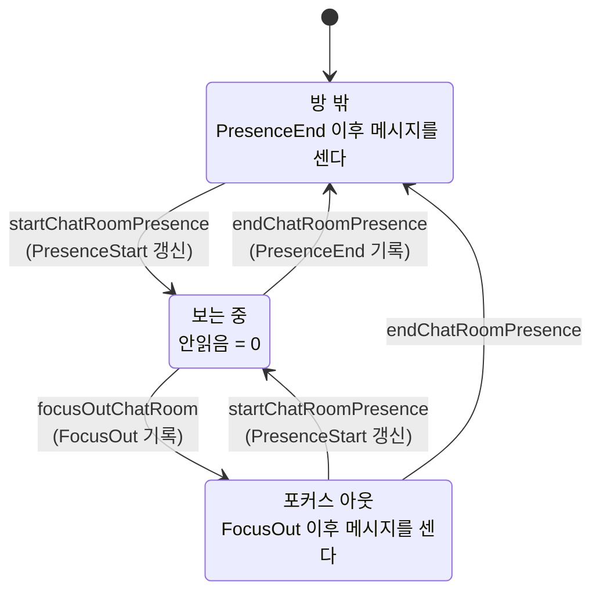
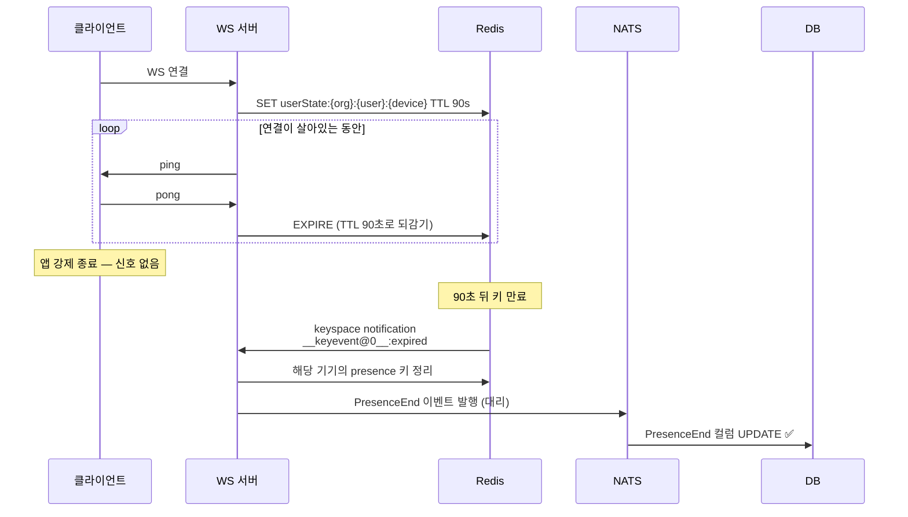

읽지 않은 메시지가 몇 개인지 세는 일. 카톡 옆에 붙는 그 빨간 숫자.

가장 먼저 떠오르는 구현은 테이블이다. 메시지가 도착하면 그 방의 참여자 수만큼 `UnreadMessages`에 row를 꽂고, 누가 읽으면 그 사람 row를 지운다. 개수가 필요하면 `COUNT(*)`. 직관적이고, 무엇보다 정확하다.

내가 참여한 프로젝트도 그렇게 굴러가고 있었다. 그리고 그 테이블이 문제가 됐다.

## 테이블은 왜 커지는가

메시지 하나가 20명짜리 방에 도착하면 row 20개가 생긴다. 100명이면 100개. 저장량이 **메시지 × 참여자**로 곱해진다.

```
메시지 1만 개 × 평균 참여자 30명 = row 30만 개
```

읽으면 지워지니까 결국 줄어들 것 같지만, 실제로는 그렇지 않다. 며칠 안 들어온 사람, 알림만 쌓아두는 사람, 퇴사했는데 방에는 남아 있는 계정. 이런 계정들의 row가 바닥에 눌어붙는다. INSERT는 메시지마다 확정적으로 발생하고 DELETE는 사람이 들어와야만 일어나니, 유입은 보장되고 배출은 보장되지 않는다.

거기에 인덱스가 붙는다. 테이블이 커지면 인덱스가 더 커지고, 커진 인덱스는 INSERT를 느리게 만든다. 느려진 INSERT는 메시지 저장 경로에 있다.

정리하면 이 구조의 문제는 용량이 아니라 **쓰기 증폭**이다. 메시지 한 번에 쓰기가 N번 따라붙는다.

## 통찰 하나 — 읽음은 항상 접두사다

여기서 관점을 한 번 바꿔보자.

채팅방의 메시지는 시간순으로 쌓인다. 그리고 사람은 위에서부터 순서대로 읽는다. 3번과 7번만 읽고 5번은 건너뛰는 읽기는 존재하지 않는다. 스크롤을 어떻게 굴리든, 어느 순간의 상태를 스냅샷으로 찍으면 항상 이 모양이다.

```
[읽음][읽음][읽음][읽음] │ [안읽음][안읽음][안읽음]
                        ↑
                      경계선
```

읽은 집합은 언제나 전체의 **접두사(prefix)** 다. 중간에 구멍이 뚫린 형태가 나올 수 없다.

이 성질이 성립하면, 안 읽은 메시지 목록을 실체로 들고 있을 이유가 사라진다. 경계선의 위치 하나만 알면 나머지는 전부 계산해낼 수 있으니까. 집합을 저장할 것이냐, 집합을 규정하는 한 점을 저장할 것이냐의 문제다.

| | 테이블 방식 | 경계선 방식 |
|---|---|---|
| 저장 대상 | 안 읽은 메시지 **목록** | 경계 **시각 하나** |
| 저장량 | 메시지 × 참여자 | 참여자당 컬럼 몇 개 |
| 메시지 도착 시 | row N개 INSERT | 아무것도 안 함 |
| 읽음 처리 | row DELETE | 경계선 이동 |
| 개수 조회 | `COUNT(row)` — 거의 공짜 | 경계선 이후 메시지 `COUNT` |

쓰기 비용을 읽기 비용과 맞바꾸는 거래다. 상태를 미리 펼쳐두느냐(materialize), 필요할 때 유도하느냐(derive)의 고전적인 선택이기도 하고.

## "읽음 처리"라는 개념을 지운다

여기서 한 번 더 뒤집는다. 이 부분이 개인적으로 제일 재밌었다.

보통은 "읽음 처리 API"를 만든다. 클라이언트가 메시지를 화면에 띄우면 서버에 알리고, 서버가 경계선을 옮긴다. 그런데 실제 구현에는 그런 API가 없다. 대신 전제를 이렇게 세웠다.

> **방에 들어와 있는 동안은 전부 읽은 것으로 친다. 그러니 "언제 나갔는지"만 기록하면 된다.**

읽음을 기록하는 대신 **안 읽기 시작한 순간**을 기록한다. 부정의 형태로 뒤집은 것이다.

```
10:00        10:05       10:07        10:09      10:12
  │            │           │            │          │
방 진입      메시지 A     방 나감      메시지 B   메시지 C
  │                        │            └─────┬─────┘
PresenceStart          PresenceEnd        안읽음 = 2
  └──── 이 구간의 메시지는 자동으로 읽음 ────┘
```

`안읽음 = COUNT(메시지 WHERE CreatedAt > PresenceEnd)`. 이게 전부다. 메시지 A는 세지도 않는다. 경계선보다 앞이니까 판단할 필요조차 없다.

방에 다시 들어오면 `PresenceStart`가 갱신되면서 `PresenceStart > PresenceEnd`가 된다. 이 부등호 자체가 **"지금 방 안에 있음"** 이라는 뜻이 되고, 카운트 쿼리는 이 조건을 만나면 통째로 0을 반환한다. "전부 읽음 처리" 로직을 따로 짜지 않아도 되는 이유다. 상태가 곧 답이다.

## 경계선이 세 개인 이유

`PresenceEnd` 하나로 끝날 것 같지만, 실제로는 시각 컬럼이 세 개다.

- `PresenceStart` — 방에 들어온 시각
- `FocusOut` — 방에는 있지만 시선을 뗀 시각
- `PresenceEnd` — 방을 떠난 시각

세 번째가 왜 필요한지는 이 상황을 떠올리면 된다. 채팅창을 띄워둔 채로 다른 탭에서 작업하는 사람. 방을 나간 건 아니지만 메시지를 읽고 있는 것도 아니다. 이 사람에게 "방에 있으니 다 읽음"을 적용하면, 돌아왔을 때 안읽음이 0으로 초기화된 채 메시지 수십 개가 조용히 묻힌다.

그래서 이탈과 포커스 아웃을 나눠서 기록하되, 계산할 때는 다시 합친다.

```sql
cm.CreatedAt > GREATEST(rp.PresenceEnd, rp.FocusOut)
```

`GREATEST`가 **"마지막으로 눈을 뗀 시각"** 이다. 나갔든 시선만 돌렸든, 더 최근에 일어난 사건이 경계선이 된다. 두 종류의 이탈을 하나의 좌표로 눌러 담는 셈이다.

게이팅 조건도 같은 문장으로 읽힌다.

```sql
(rp.PresenceStart <= rp.PresenceEnd          -- 나가 있음
 OR rp.FocusOut  >= rp.PresenceStart)        -- 있긴 한데 안 보는 중
```

둘 다 거짓이면 지금 보고 있다는 뜻이고, 카운트는 0이다.

상태 전이로 그리면 이렇다.



## 쿼리 해부

방 목록을 조회할 때 방마다 붙는 상관 서브쿼리는 이렇게 생겼다.

```sql
SELECT COUNT(*)
FROM ChatMessages cm
WHERE cm.RoomId = r.RoomId
  AND (rp.PresenceStart <= rp.PresenceEnd
       OR rp.FocusOut >= rp.PresenceStart)      -- ① 지금 안 보는 중일 때만 센다
  AND cm.CreatedAt > GREATEST(rp.PresenceEnd, rp.FocusOut)  -- ② 눈 뗀 이후
  AND cm.CreatedAt > rp.JoinedAt                -- ③ 내가 들어오기 전 건 제외
  AND cm.Discard = 0
  AND cm.UserId != rp.UserId                    -- ④ 내가 쓴 건 제외
```

네 줄이 각각 하나씩 맡는다. ①은 "보고 있으면 0", ②가 경계선, ③은 방에 늦게 합류한 사람이 이전 대화를 안읽음으로 떠안지 않게 하는 장치, ④는 자기 메시지 제외.

멘션 카운트도 같은 경계선을 그대로 재사용한다. 멘션 테이블과 조인한 뒤 조건만 얹으면 된다. 경계선 하나가 여러 종류의 "안읽음"을 동시에 규정하는 것 — 이게 이 설계에서 가장 이득이 큰 지점이다. 기존 방식이었다면 멘션 안읽음을 위해 또 다른 플래그나 테이블이 필요했을 것이다.

## 아킬레스건 — 종료 신호는 생각보다 안 온다

여기까지는 깔끔하다. 그런데 이 설계에는 구조적인 구멍이 하나 있다.

> **브라우저를 강제 종료하면 "나갑니다" 신호가 오지 않는다.**

지하철에서 신호가 끊기거나, 앱이 죽거나, 노트북 덮개를 그냥 닫거나. 그러면 `PresenceEnd`가 영영 안 찍힌다. 서버 입장에서는 `PresenceStart > PresenceEnd`가 계속 유지되니 **"이 사람 아직 방에서 보고 있음"** 으로 읽힌다. 그 뒤에 오는 모든 메시지가 자동으로 읽음 처리된다. 안읽음이 영원히 0인 계정이 만들어진다.

테이블 방식에는 이 문제가 없었다. INSERT는 이미 끝났고 DELETE를 안 하면 그만이니까. 안전한 쪽으로 실패한다.

경계선 방식은 반대다. **신호를 못 받으면 위험한 쪽으로 실패한다.** 저장 비용을 줄인 대가로 "종료 신호를 반드시 확보해야 한다"는 부채를 새로 진 것이다.

이 부채를 Redis가 갚는다.



TTL 90초를 걸어두고 **WS의 pong을 받을 때마다 되감는다.** 하트비트 이벤트를 새로 정의하지 않고 WebSocket 프로토콜에 이미 있는 ping/pong을 쓴 게 깔끔하다. 연결이 살아있다는 사실 자체가 이미 프로토콜 레벨에서 증명되고 있으니, 그걸 그대로 신호로 쓴 것이다.

연결이 끊기면 pong이 멎고, 90초 뒤 키가 만료되고, Redis가 keyspace notification을 쏜다. 구독하고 있던 쪽이 그걸 받아서 죽은 기기의 흔적을 지우고 이탈 이벤트를 **대신** 발행한다. 클라이언트가 못 보낸 작별 인사를 서버가 대신 해주는 구조다.

서버 자신이 죽어 있던 동안 쌓인 유령 키는 부팅 시점에 한 번 훑어서 정리한다. TTL은 어디까지나 "살아있는 감시자"가 있어야 동작하는 장치라, 감시자 부재 구간을 메우는 보완이 따로 필요하다.

여기서 짚고 넘어갈 점. **이 설계에서 Redis는 캐시가 아니다.** 조회를 빠르게 하려고 넣은 게 아니라, 말없이 사라진 클라이언트를 감지하기 위해 넣었다. 캐시 역할은 부수적으로 따라온 것에 가깝다. 컴포넌트를 왜 넣었는지 물었을 때 "빠르니까"가 아니라 "이 실패 모드를 막으려고"라고 답할 수 있는 편이 훨씬 건강하다.

## 기기가 여러 개일 때

경계선은 사용자당 하나인데, 접속 기기는 여러 개다.

폰과 데스크탑으로 동시에 접속한 상태에서 폰만 껐다고 경계선을 찍으면, 데스크탑에서 멀쩡히 읽고 있는 메시지가 안읽음으로 집계된다. 반대로 폰이 죽었는데 아무 처리도 안 하면 위의 아킬레스건으로 돌아간다.

그래서 Redis 키를 기기 단위로 쪼갠다.

```
roomPresence:{orgId}:{roomId}:{userId}:{deviceId}
    HASH { presenceStart, focusOut, presenceEnd }
```

그리고 DB로 결론을 내려보내는 시점에 조건을 건다.

- **진입**: 활성 기기가 나 하나뿐일 때만 "들어왔음"을 발행한다. 두 번째 기기가 들어오는 건 상태 변화가 아니다.
- **이탈**: **모든** 기기가 방을 떠났을 때만 "나갔음"을 발행한다.
- **포커스 아웃**: **모든** 기기가 포커스를 잃었을 때만 발행한다. 한 대라도 보고 있으면 보고 있는 것이다.

Redis가 기기별 상태를 모아 **사용자 단위의 결론**으로 접고, DB에는 그 결론만 내려간다. 계층이 자연스럽게 나뉜다.

```
기기별 raw 상태  →  Redis (집계 + 생존 감지)
사용자별 결론    →  DB RoomParticipants (SSOT)
```

DB가 진실의 원천이고 Redis는 그 앞단의 집계·감지 레이어다. Redis가 통째로 날아가도 DB의 경계선은 남아 있으니, 최악의 경우 "그 순간 방에 있던 사람들의 읽음이 조금 늦게 반영되는" 정도로 손실이 국한된다. 이 경계를 명확히 그어둔 게 이 구조에서 마음에 드는 부분이다.

## 대가 — 잃어버린 숫자

좋은 것만 있지는 않다.

기존 테이블 방식은 **메시지별 "N명이 안 읽음"** 을 공짜로 줬다. 카톡 말풍선 옆에 붙는 그 작은 숫자 말이다. 해당 메시지 ID의 row를 세면 끝이니까.

경계선 방식에서는 이게 공짜가 아니다. 특정 메시지를 몇 명이 안 읽었는지 알려면 "이 메시지 시각보다 경계선이 앞선 참여자 수"를 세야 하는데, 화면에 뿌릴 메시지 100개에 대해 각각 참여자 30명과 비교하면 3천 번의 비교가 매 조회마다 발생한다. 서버에서 이걸 SQL로 돌리면 이득을 도로 반납하게 된다.

그래서 이렇게 나눴다.

- 메시지 목록 API는 메시지별 안읽음 수를 **계산하지 않는다.** 0으로 내려준다.
- 대신 **참여자별 경계선 목록**을 주는 API를 새로 만든다.
- 클라이언트가 그 배열을 들고 메시지 시각과 비교해 화면에서 직접 계산한다.

서버는 **원재료(경계선)** 만 주고 표시 계산은 클라이언트가 한다. 참여자 수는 보통 수십 명이고 화면에 보이는 메시지도 수십 개라, 클라이언트에서는 부담이 크지 않다. 게다가 실시간 이벤트로 경계선 변동을 계속 받으니, 서버를 다시 찌르지 않고도 숫자가 살아 움직인다.

다만 이건 백엔드 최적화를 **프론트엔드 작업으로 전가**한 것이기도 하다. 이런 종류의 설계 변경은 API 스펙 문서 한 줄로 끝나지 않는다. 상대 팀의 일정에 실제로 일이 생긴다. 합의 없이 밀면 사이가 나빠진다.

## 남은 리스크 두 가지

구현을 읽으면서 걸린 지점도 적어둔다. 둘 다 이런 방식으로 전환할 때 일반적으로 밟기 쉬운 지뢰다.

**하나. 같은 개념을 두 곳에서 다르게 판정하는 문제.**

방 목록의 멘션 배지는 `GREATEST(PresenceEnd, FocusOut)`로 경계를 잡는데, 멘션 목록 조회 쪽은 `PresenceEnd`만 본다. 포커스 아웃 상태에서 받은 멘션이 배지에는 잡히고 목록에는 안 잡히는 상황이 나올 수 있다. 배지에 3이 떠 있는데 열어보면 항목이 하나뿐인, 사용자가 제일 싫어하는 종류의 버그다.

경계선 방식은 판정식이 여러 쿼리에 흩어지기 쉽다. 테이블 방식이라면 "row가 있냐 없냐" 하나로 통일됐을 것을, 부등호 조합으로 표현하면서 각 호출 경로가 조금씩 다른 버전을 갖게 된다. **판정식을 한 군데로 모으는 것**이 이 설계의 유지보수 핵심이다.

**둘. 시계를 누가 찍느냐.**

경계선 시각은 WebSocket 서버가 찍고, 메시지 생성 시각은 메시지 처리 경로에서 찍는다. 서로 다른 프로세스다. 그런데 비교는 밀리초 단위 문자열의 사전순으로 이뤄진다.

두 서버의 시계가 수백 밀리초만 어긋나도 경계 근처 메시지의 읽음/안읽음이 뒤집힌다. "방에 들어간 직후 도착한 메시지가 안읽음으로 남는" 식의, 재현이 어렵고 로그로 쫓기도 힘든 버그가 된다. 시각을 비교로 쓰는 설계라면 시각을 발급하는 주체를 하나로 모으거나, 최소한 어긋남의 상한을 알고 있어야 한다.

## 정리

무엇을 무엇과 바꿨는지로 정리하면 이렇게 된다.

| 얻은 것 | 내준 것 |
|---|---|
| 메시지당 N번의 INSERT 제거 | 조회 시 COUNT 쿼리 (인덱스 의존) |
| 테이블 무한 증식 차단 | 종료 신호 확보 부담 (Redis TTL 필요) |
| 멘션 등 파생 지표를 경계선 재사용으로 해결 | 판정식이 여러 쿼리로 분산 |
| 별도 "읽음 처리" 로직 불필요 | 메시지별 안읽음 수를 클라이언트로 이관 |

핵심은 결국 하나였다. **읽음이 접두사라는 성질을 알아채는 것.** 그 성질이 성립하는 순간 N×M개의 row는 시각 하나로 압축된다. 반대로 말하면, 접두사가 아닌 도메인 — 예를 들어 임의의 항목을 골라서 체크할 수 있는 할 일 목록 같은 것 — 에서는 이 트릭이 통하지 않는다.

데이터를 저장할지 규칙을 저장할지. 자료구조를 바꾸면 알고리즘이 따라온다는 오래된 이야기가, 실무 스키마에서도 똑같이 반복된다.
